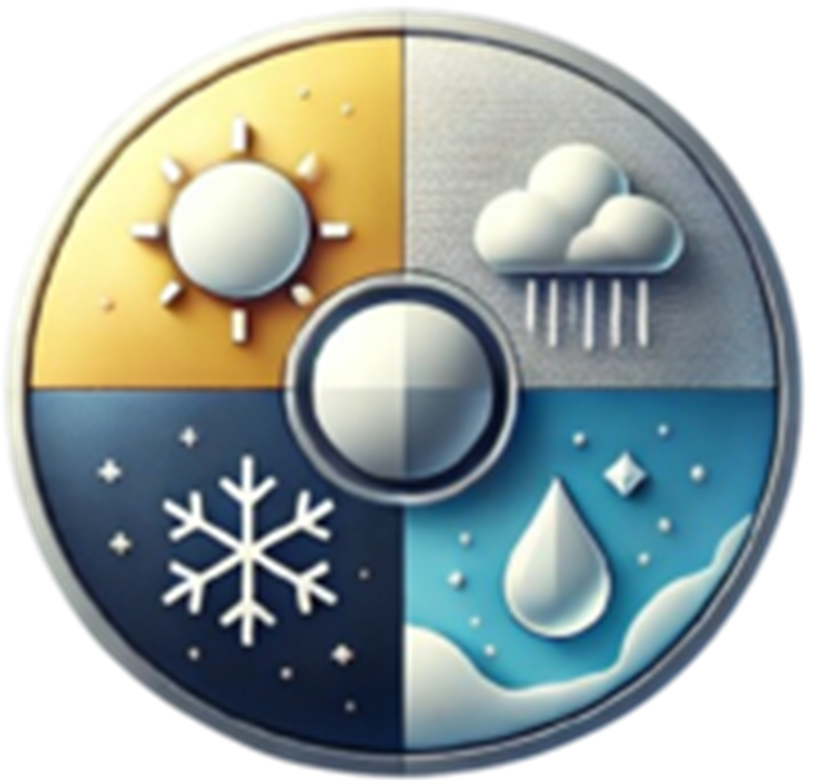

[![Contributors][contributors-shield]][contributors-url]
[![Stargazers][stars-shield]][stars-url]
[![Issues][issues-shield]][issues-url]

# WeatherPaper

 

The will change the wallpaper of Wallpaper Engine based on the current weather condition of your location and the time of the day.
That means that you need to set playlist in Wallpaper Engine with the name of the weather condition and the time of the day.

## Installation 

Download the last release of the application [here](https://github.com/YuToutCourt/WeatherPaper/releases/)

Unzip the file and modify the `.env` file with your own API key from [VisualCrossing](https://www.visualcrossing.com/)

Locate the Wallpaper Engine installation folder and add its path to the `.env` file.
You can get more information on that [here](https://help.wallpaperengine.io/en/functionality/cli.html#command-line-controls)

## Playlist in Wallpaper Engine
|  | 
|:--:| 
| *Showcase of compatible playlist names in Wallpaper Engine* |

### **⚠️ Your playlist absolutely need to have a title in the list down below ⚠️**
- Ensure the title is exactly as shown in the list to avoid issues.
- The playlist names are case-sensitive and must be used consistently across the tool.

All titles available for the playlist (Clike Me)

Winter

Day

- winter-blowingordriftingsnow-day
- winter-heavyfreezingdrizzle/freezingrain-day
- winter-lightfreezingdrizzle/freezingrain-day
- winter-freezingfog-day
- winter-heavyfreezingrain-day
- winter-lightfreezingrain-day
- winter-funnelcloud/tornado-day
- winter-hailshowers-day
- winter-ice-day
- winter-lightningwithoutthunder-day
- winter-mist-day
- winter-drizzle-day
- winter-precipitationinvicinity-day
- winter-rain-day
- winter-heavyrainandsnow-day
- winter-lightrainandsnow-day
- winter-rainshowers-day
- winter-heavyrain-day
- winter-lightrain-day
- winter-skycoveragedecreasing-day
- winter-skycoverageincreasing-day
- winter-skyunchanged-day
- winter-heavydrizzle-day
- winter-smokeorhaze-day
- winter-snow-day
- winter-snowandrainshowers-day
- winter-snowshowers-day
- winter-heavysnow-day
- winter-lightsnow-day
- winter-squalls-day
- winter-thunderstorm-day
- winter-thunderstormwithoutprecipitation-day
- winter-diamonddust-day
- winter-lightdrizzle-day
- winter-hail-day
- winter-overcast-day
- winter-partiallycloudy-day
- winter-clear-day
- winter-heavydrizzle/rain-day
- winter-lightdrizzle/rain-day
- winter-duststorm-day
- winter-fog-day
- winter-freezingdrizzle/freezingrain-day

Night

- winter-blowingordriftingsnow-night
- winter-heavyfreezingdrizzle/freezingrain-night
- winter-lightfreezingdrizzle/freezingrain-night
- winter-freezingfog-night
- winter-heavyfreezingrain-night
- winter-lightfreezingrain-night
- winter-funnelcloud/tornado-night
- winter-hailshowers-night
- winter-ice-night
- winter-lightningwithoutthunder-night
- winter-mist-night
- winter-drizzle-night
- winter-precipitationinvicinity-night
- winter-rain-night
- winter-heavyrainandsnow-night
- winter-lightrainandsnow-night
- winter-rainshowers-night
- winter-heavyrain-night
- winter-lightrain-night
- winter-skycoveragedecreasing-night
- winter-skycoverageincreasing-night
- winter-skyunchanged-night
- winter-heavydrizzle-night
- winter-smokeorhaze-night
- winter-snow-night
- winter-snowandrainshowers-night
- winter-snowshowers-night
- winter-heavysnow-night
- winter-lightsnow-night
- winter-squalls-night
- winter-thunderstorm-night
- winter-thunderstormwithoutprecipitation-night
- winter-diamonddust-night
- winter-lightdrizzle-night
- winter-hail-night
- winter-overcast-night
- winter-partiallycloudy-night
- winter-clear-night
- winter-heavydrizzle/rain-night
- winter-lightdrizzle/rain-night
- winter-duststorm-night
- winter-fog-night
- winter-freezingdrizzle/freezingrain-night

Sunrise

- winter-blowingordriftingsnow-sunrise
- winter-heavyfreezingdrizzle/freezingrain-sunrise
- winter-lightfreezingdrizzle/freezingrain-sunrise
- winter-freezingfog-sunrise
- winter-heavyfreezingrain-sunrise
- winter-lightfreezingrain-sunrise
- winter-funnelcloud/tornado-sunrise
- winter-hailshowers-sunrise
- winter-ice-sunrise
- winter-lightningwithoutthunder-sunrise
- winter-mist-sunrise
- winter-drizzle-sunrise
- winter-precipitationinvicinity-sunrise
- winter-rain-sunrise
- winter-heavyrainandsnow-sunrise
- winter-lightrainandsnow-sunrise
- winter-rainshowers-sunrise
- winter-heavyrain-sunrise
- winter-lightrain-sunrise
- winter-skycoveragedecreasing-sunrise
- winter-skycoverageincreasing-sunrise
- winter-skyunchanged-sunrise
- winter-heavydrizzle-sunrise
- winter-smokeorhaze-sunrise
- winter-snow-sunrise
- winter-snowandrainshowers-sunrise
- winter-snowshowers-sunrise
- winter-heavysnow-sunrise
- winter-lightsnow-sunrise
- winter-squalls-sunrise
- winter-thunderstorm-sunrise
- winter-thunderstormwithoutprecipitation-sunrise
- winter-diamonddust-sunrise
- winter-lightdrizzle-sunrise
- winter-hail-sunrise
- winter-overcast-sunrise
- winter-partiallycloudy-sunrise
- winter-clear-sunrise
- winter-heavydrizzle/rain-sunrise
- winter-lightdrizzle/rain-sunrise
- winter-duststorm-sunrise
- winter-fog-sunrise
- winter-freezingdrizzle/freezingrain-sunrise

Sunset

- winter-blowingordriftingsnow-sunset
- winter-heavyfreezingdrizzle/freezingrain-sunset
- winter-lightfreezingdrizzle/freezingrain-sunset
- winter-freezingfog-sunset
- winter-heavyfreezingrain-sunset
- winter-lightfreezingrain-sunset
- winter-funnelcloud/tornado-sunset
- winter-hailshowers-sunset
- winter-ice-sunset
- winter-lightningwithoutthunder-sunset
- winter-mist-sunset
- winter-drizzle-sunset
- winter-precipitationinvicinity-sunset
- winter-rain-sunset
- winter-heavyrainandsnow-sunset
- winter-lightrainandsnow-sunset
- winter-rainshowers-sunset
- winter-heavyrain-sunset
- winter-lightrain-sunset
- winter-skycoveragedecreasing-sunset
- winter-skycoverageincreasing-sunset
- winter-skyunchanged-sunset
- winter-heavydrizzle-sunset
- winter-smokeorhaze-sunset
- winter-snow-sunset
- winter-snowandrainshowers-sunset
- winter-snowshowers-sunset
- winter-heavysnow-sunset
- winter-lightsnow-sunset
- winter-squalls-sunset
- winter-thunderstorm-sunset
- winter-thunderstormwithoutprecipitation-sunset
- winter-diamonddust-sunset
- winter-lightdrizzle-sunset
- winter-hail-sunset
- winter-overcast-sunset
- winter-partiallycloudy-sunset
- winter-clear-sunset
- winter-heavydrizzle/rain-sunset
- winter-lightdrizzle/rain-sunset
- winter-duststorm-sunset
- winter-fog-sunset
- winter-freezingdrizzle/freezingrain-sunset

Summer

Day

- summer-blowingordriftingsnow-day
- summer-heavyfreezingdrizzle/freezingrain-day
- summer-lightfreezingdrizzle/freezingrain-day
- summer-freezingfog-day
- summer-heavyfreezingrain-day
- summer-lightfreezingrain-day
- summer-funnelcloud/tornado-day
- summer-hailshowers-day
- summer-ice-day
- summer-lightningwithoutthunder-day
- summer-mist-day
- summer-drizzle-day
- summer-precipitationinvicinity-day
- summer-rain-day
- summer-heavyrainandsnow-day
- summer-lightrainandsnow-day
- summer-rainshowers-day
- summer-heavyrain-day
- summer-lightrain-day
- summer-skycoveragedecreasing-day
- summer-skycoverageincreasing-day
- summer-skyunchanged-day
- summer-heavydrizzle-day
- summer-smokeorhaze-day
- summer-snow-day
- summer-snowandrainshowers-day
- summer-snowshowers-day
- summer-heavysnow-day
- summer-lightsnow-day
- summer-squalls-day
- summer-thunderstorm-day
- summer-thunderstormwithoutprecipitation-day
- summer-diamonddust-day
- summer-lightdrizzle-day
- summer-hail-day
- summer-overcast-day
- summer-partiallycloudy-day
- summer-clear-day
- summer-heavydrizzle/rain-day
- summer-lightdrizzle/rain-day
- summer-duststorm-day
- summer-fog-day
- summer-freezingdrizzle/freezingrain-day

Night

- summer-blowingordriftingsnow-night
- summer-heavyfreezingdrizzle/freezingrain-night
- summer-lightfreezingdrizzle/freezingrain-night
- summer-freezingfog-night
- summer-heavyfreezingrain-night
- summer-lightfreezingrain-night
- summer-funnelcloud/tornado-night
- summer-hailshowers-night
- summer-ice-night
- summer-lightningwithoutthunder-night
- summer-mist-night
- summer-drizzle-night
- summer-precipitationinvicinity-night
- summer-rain-night
- summer-heavyrainandsnow-night
- summer-lightrainandsnow-night
- summer-rainshowers-night
- summer-heavyrain-night
- summer-lightrain-night
- summer-skycoveragedecreasing-night
- summer-skycoverageincreasing-night
- summer-skyunchanged-night
- summer-heavydrizzle-night
- summer-smokeorhaze-night
- summer-snow-night
- summer-snowandrainshowers-night
- summer-snowshowers-night
- summer-heavysnow-night
- summer-lightsnow-night
- summer-squalls-night
- summer-thunderstorm-night
- summer-thunderstormwithoutprecipitation-night
- summer-diamonddust-night
- summer-lightdrizzle-night
- summer-hail-night
- summer-overcast-night
- summer-partiallycloudy-night
- summer-clear-night
- summer-heavydrizzle/rain-night
- summer-lightdrizzle/rain-night
- summer-duststorm-night
- summer-fog-night
- summer-freezingdrizzle/freezingrain-night

Sunrise

- summer-blowingordriftingsnow-sunrise
- summer-heavyfreezingdrizzle/freezingrain-sunrise
- summer-lightfreezingdrizzle/freezingrain-sunrise
- summer-freezingfog-sunrise
- summer-heavyfreezingrain-sunrise
- summer-lightfreezingrain-sunrise
- summer-funnelcloud/tornado-sunrise
- summer-hailshowers-sunrise
- summer-ice-sunrise
- summer-lightningwithoutthunder-sunrise
- summer-mist-sunrise
- summer-drizzle-sunrise
- summer-precipitationinvicinity-sunrise
- summer-rain-sunrise
- summer-heavyrainandsnow-sunrise
- summer-lightrainandsnow-sunrise
- summer-rainshowers-sunrise
- summer-heavyrain-sunrise
- summer-lightrain-sunrise
- summer-skycoveragedecreasing-sunrise
- summer-skycoverageincreasing-sunrise
- summer-skyunchanged-sunrise
- summer-heavydrizzle-sunrise
- summer-smokeorhaze-sunrise
- summer-snow-sunrise
- summer-snowandrainshowers-sunrise
- summer-snowshowers-sunrise
- summer-heavysnow-sunrise
- summer-lightsnow-sunrise
- summer-squalls-sunrise
- summer-thunderstorm-sunrise
- summer-thunderstormwithoutprecipitation-sunrise
- summer-diamonddust-sunrise
- summer-lightdrizzle-sunrise
- summer-hail-sunrise
- summer-overcast-sunrise
- summer-partiallycloudy-sunrise
- summer-clear-sunrise
- summer-heavydrizzle/rain-sunrise
- summer-lightdrizzle/rain-sunrise
- summer-duststorm-sunrise
- summer-fog-sunrise
- summer-freezingdrizzle/freezingrain-sunrise

Sunset

- summer-blowingordriftingsnow-sunset
- summer-heavyfreezingdrizzle/freezingrain-sunset
- summer-lightfreezingdrizzle/freezingrain-sunset
- summer-freezingfog-sunset
- summer-heavyfreezingrain-sunset
- summer-lightfreezingrain-sunset
- summer-funnelcloud/tornado-sunset
- summer-hailshowers-sunset
- summer-ice-sunset
- summer-lightningwithoutthunder-sunset
- summer-mist-sunset
- summer-drizzle-sunset
- summer-precipitationinvicinity-sunset
- summer-rain-sunset
- summer-heavyrainandsnow-sunset
- summer-lightrainandsnow-sunset
- summer-rainshowers-sunset
- summer-heavyrain-sunset
- summer-lightrain-sunset
- summer-skycoveragedecreasing-sunset
- summer-skycoverageincreasing-sunset
- summer-skyunchanged-sunset
- summer-heavydrizzle-sunset
- summer-smokeorhaze-sunset
- summer-snow-sunset
- summer-snowandrainshowers-sunset
- summer-snowshowers-sunset
- summer-heavysnow-sunset
- summer-lightsnow-sunset
- summer-squalls-sunset
- summer-thunderstorm-sunset
- summer-thunderstormwithoutprecipitation-sunset
- summer-diamonddust-sunset
- summer-lightdrizzle-sunset
- summer-hail-sunset
- summer-overcast-sunset
- summer-partiallycloudy-sunset
- summer-clear-sunset
- summer-heavydrizzle/rain-sunset
- summer-lightdrizzle/rain-sunset
- summer-duststorm-sunset
- summer-fog-sunset
- summer-freezingdrizzle/freezingrain-sunset

Fall

Day

- fall-blowingordriftingsnow-day
- fall-heavyfreezingdrizzle/freezingrain-day
- fall-lightfreezingdrizzle/freezingrain-day
- fall-freezingfog-day
- fall-heavyfreezingrain-day
- fall-lightfreezingrain-day
- fall-funnelcloud/tornado-day
- fall-hailshowers-day
- fall-ice-day
- fall-lightningwithoutthunder-day
- fall-mist-day
- fall-drizzle-day
- fall-precipitationinvicinity-day
- fall-rain-day
- fall-heavyrainandsnow-day
- fall-lightrainandsnow-day
- fall-rainshowers-day
- fall-heavyrain-day
- fall-lightrain-day
- fall-skycoveragedecreasing-day
- fall-skycoverageincreasing-day
- fall-skyunchanged-day
- fall-heavydrizzle-day
- fall-smokeorhaze-day
- fall-snow-day
- fall-snowandrainshowers-day
- fall-snowshowers-day
- fall-heavysnow-day
- fall-lightsnow-day
- fall-squalls-day
- fall-thunderstorm-day
- fall-thunderstormwithoutprecipitation-day
- fall-diamonddust-day
- fall-lightdrizzle-day
- fall-hail-day
- fall-overcast-day
- fall-partiallycloudy-day
- fall-clear-day
- fall-heavydrizzle/rain-day
- fall-lightdrizzle/rain-day
- fall-duststorm-day
- fall-fog-day
- fall-freezingdrizzle/freezingrain-day

Night

- fall-blowingordriftingsnow-night
- fall-heavyfreezingdrizzle/freezingrain-night
- fall-lightfreezingdrizzle/freezingrain-night
- fall-freezingfog-night
- fall-heavyfreezingrain-night
- fall-lightfreezingrain-night
- fall-funnelcloud/tornado-night
- fall-hailshowers-night
- fall-ice-night
- fall-lightningwithoutthunder-night
- fall-mist-night
- fall-drizzle-night
- fall-precipitationinvicinity-night
- fall-rain-night
- fall-heavyrainandsnow-night
- fall-lightrainandsnow-night
- fall-rainshowers-night
- fall-heavyrain-night
- fall-lightrain-night
- fall-skycoveragedecreasing-night
- fall-skycoverageincreasing-night
- fall-skyunchanged-night
- fall-heavydrizzle-night
- fall-smokeorhaze-night
- fall-snow-night
- fall-snowandrainshowers-night
- fall-snowshowers-night
- fall-heavysnow-night
- fall-lightsnow-night
- fall-squalls-night
- fall-thunderstorm-night
- fall-thunderstormwithoutprecipitation-night
- fall-diamonddust-night
- fall-lightdrizzle-night
- fall-hail-night
- fall-overcast-night
- fall-partiallycloudy-night
- fall-clear-night
- fall-heavydrizzle/rain-night
- fall-lightdrizzle/rain-night
- fall-duststorm-night
- fall-fog-night
- fall-freezingdrizzle/freezingrain-night

Sunrise

- fall-blowingordriftingsnow-sunrise
- fall-heavyfreezingdrizzle/freezingrain-sunrise
- fall-lightfreezingdrizzle/freezingrain-sunrise
- fall-freezingfog-sunrise
- fall-heavyfreezingrain-sunrise
- fall-lightfreezingrain-sunrise
- fall-funnelcloud/tornado-sunrise
- fall-hailshowers-sunrise
- fall-ice-sunrise
- fall-lightningwithoutthunder-sunrise
- fall-mist-sunrise
- fall-drizzle-sunrise
- fall-precipitationinvicinity-sunrise
- fall-rain-sunrise
- fall-heavyrainandsnow-sunrise
- fall-lightrainandsnow-sunrise
- fall-rainshowers-sunrise
- fall-heavyrain-sunrise
- fall-lightrain-sunrise
- fall-skycoveragedecreasing-sunrise
- fall-skycoverageincreasing-sunrise
- fall-skyunchanged-sunrise
- fall-heavydrizzle-sunrise
- fall-smokeorhaze-sunrise
- fall-snow-sunrise
- fall-snowandrainshowers-sunrise
- fall-snowshowers-sunrise
- fall-heavysnow-sunrise
- fall-lightsnow-sunrise
- fall-squalls-sunrise
- fall-thunderstorm-sunrise
- fall-thunderstormwithoutprecipitation-sunrise
- fall-diamonddust-sunrise
- fall-lightdrizzle-sunrise
- fall-hail-sunrise
- fall-overcast-sunrise
- fall-partiallycloudy-sunrise
- fall-clear-sunrise
- fall-heavydrizzle/rain-sunrise
- fall-lightdrizzle/rain-sunrise
- fall-duststorm-sunrise
- fall-fog-sunrise
- fall-freezingdrizzle/freezingrain-sunrise

Sunset

- fall-blowingordriftingsnow-sunset
- fall-heavyfreezingdrizzle/freezingrain-sunset
- fall-lightfreezingdrizzle/freezingrain-sunset
- fall-freezingfog-sunset
- fall-heavyfreezingrain-sunset
- fall-lightfreezingrain-sunset
- fall-funnelcloud/tornado-sunset
- fall-hailshowers-sunset
- fall-ice-sunset
- fall-lightningwithoutthunder-sunset
- fall-mist-sunset
- fall-drizzle-sunset
- fall-precipitationinvicinity-sunset
- fall-rain-sunset
- fall-heavyrainandsnow-sunset
- fall-lightrainandsnow-sunset
- fall-rainshowers-sunset
- fall-heavyrain-sunset
- fall-lightrain-sunset
- fall-skycoveragedecreasing-sunset
- fall-skycoverageincreasing-sunset
- fall-skyunchanged-sunset
- fall-heavydrizzle-sunset
- fall-smokeorhaze-sunset
- fall-snow-sunset
- fall-snowandrainshowers-sunset
- fall-snowshowers-sunset
- fall-heavysnow-sunset
- fall-lightsnow-sunset
- fall-squalls-sunset
- fall-thunderstorm-sunset
- fall-thunderstormwithoutprecipitation-sunset
- fall-diamonddust-sunset
- fall-lightdrizzle-sunset
- fall-hail-sunset
- fall-overcast-sunset
- fall-partiallycloudy-sunset
- fall-clear-sunset
- fall-heavydrizzle/rain-sunset
- fall-lightdrizzle/rain-sunset
- fall-duststorm-sunset
- fall-fog-sunset
- fall-freezingdrizzle/freezingrain-sunset

Spring

Day

- spring-blowingordriftingsnow-day
- spring-heavyfreezingdrizzle/freezingrain-day
- spring-lightfreezingdrizzle/freezingrain-day
- spring-freezingfog-day
- spring-heavyfreezingrain-day
- spring-lightfreezingrain-day
- spring-funnelcloud/tornado-day
- spring-hailshowers-day
- spring-ice-day
- spring-lightningwithoutthunder-day
- spring-mist-day
- spring-drizzle-day
- spring-precipitationinvicinity-day
- spring-rain-day
- spring-heavyrainandsnow-day
- spring-lightrainandsnow-day
- spring-rainshowers-day
- spring-heavyrain-day
- spring-lightrain-day
- spring-skycoveragedecreasing-day
- spring-skycoverageincreasing-day
- spring-skyunchanged-day
- spring-heavydrizzle-day
- spring-smokeorhaze-day
- spring-snow-day
- spring-snowandrainshowers-day
- spring-snowshowers-day
- spring-heavysnow-day
- spring-lightsnow-day
- spring-squalls-day
- spring-thunderstorm-day
- spring-thunderstormwithoutprecipitation-day
- spring-diamonddust-day
- spring-lightdrizzle-day
- spring-hail-day
- spring-overcast-day
- spring-partiallycloudy-day
- spring-clear-day
- spring-heavydrizzle/rain-day
- spring-lightdrizzle/rain-day
- spring-duststorm-day
- spring-fog-day
- spring-freezingdrizzle/freezingrain-day

Night

- spring-blowingordriftingsnow-night
- spring-heavyfreezingdrizzle/freezingrain-night
- spring-lightfreezingdrizzle/freezingrain-night
- spring-freezingfog-night
- spring-heavyfreezingrain-night
- spring-lightfreezingrain-night
- spring-funnelcloud/tornado-night
- spring-hailshowers-night
- spring-ice-night
- spring-lightningwithoutthunder-night
- spring-mist-night
- spring-drizzle-night
- spring-precipitationinvicinity-night
- spring-rain-night
- spring-heavyrainandsnow-night
- spring-lightrainandsnow-night
- spring-rainshowers-night
- spring-heavyrain-night
- spring-lightrain-night
- spring-skycoveragedecreasing-night
- spring-skycoverageincreasing-night
- spring-skyunchanged-night
- spring-heavydrizzle-night
- spring-smokeorhaze-night
- spring-snow-night
- spring-snowandrainshowers-night
- spring-snowshowers-night
- spring-heavysnow-night
- spring-lightsnow-night
- spring-squalls-night
- spring-thunderstorm-night
- spring-thunderstormwithoutprecipitation-night
- spring-diamonddust-night
- spring-lightdrizzle-night
- spring-hail-night
- spring-overcast-night
- spring-partiallycloudy-night
- spring-clear-night
- spring-heavydrizzle/rain-night
- spring-lightdrizzle/rain-night
- spring-duststorm-night
- spring-fog-night
- spring-freezingdrizzle/freezingrain-night

Sunrise

- spring-blowingordriftingsnow-sunrise
- spring-heavyfreezingdrizzle/freezingrain-sunrise
- spring-lightfreezingdrizzle/freezingrain-sunrise
- spring-freezingfog-sunrise
- spring-heavyfreezingrain-sunrise
- spring-lightfreezingrain-sunrise
- spring-funnelcloud/tornado-sunrise
- spring-hailshowers-sunrise
- spring-ice-sunrise
- spring-lightningwithoutthunder-sunrise
- spring-mist-sunrise
- spring-drizzle-sunrise
- spring-precipitationinvicinity-sunrise
- spring-rain-sunrise
- spring-heavyrainandsnow-sunrise
- spring-lightrainandsnow-sunrise
- spring-rainshowers-sunrise
- spring-heavyrain-sunrise
- spring-lightrain-sunrise
- spring-skycoveragedecreasing-sunrise
- spring-skycoverageincreasing-sunrise
- spring-skyunchanged-sunrise
- spring-heavydrizzle-sunrise
- spring-smokeorhaze-sunrise
- spring-snow-sunrise
- spring-snowandrainshowers-sunrise
- spring-snowshowers-sunrise
- spring-heavysnow-sunrise
- spring-lightsnow-sunrise
- spring-squalls-sunrise
- spring-thunderstorm-sunrise
- spring-thunderstormwithoutprecipitation-sunrise
- spring-diamonddust-sunrise
- spring-lightdrizzle-sunrise
- spring-hail-sunrise
- spring-overcast-sunrise
- spring-partiallycloudy-sunrise
- spring-clear-sunrise
- spring-heavydrizzle/rain-sunrise
- spring-lightdrizzle/rain-sunrise
- spring-duststorm-sunrise
- spring-fog-sunrise
- spring-freezingdrizzle/freezingrain-sunrise

Sunset

- spring-blowingordriftingsnow-sunset
- spring-heavyfreezingdrizzle/freezingrain-sunset
- spring-lightfreezingdrizzle/freezingrain-sunset
- spring-freezingfog-sunset
- spring-heavyfreezingrain-sunset
- spring-lightfreezingrain-sunset
- spring-funnelcloud/tornado-sunset
- spring-hailshowers-sunset
- spring-ice-sunset
- spring-lightningwithoutthunder-sunset
- spring-mist-sunset
- spring-drizzle-sunset
- spring-precipitationinvicinity-sunset
- spring-rain-sunset
- spring-heavyrainandsnow-sunset
- spring-lightrainandsnow-sunset
- spring-rainshowers-sunset
- spring-heavyrain-sunset
- spring-lightrain-sunset
- spring-skycoveragedecreasing-sunset
- spring-skycoverageincreasing-sunset
- spring-skyunchanged-sunset
- spring-heavydrizzle-sunset
- spring-smokeorhaze-sunset
- spring-snow-sunset
- spring-snowandrainshowers-sunset
- spring-snowshowers-sunset
- spring-heavysnow-sunset
- spring-lightsnow-sunset
- spring-squalls-sunset
- spring-thunderstorm-sunset
- spring-thunderstormwithoutprecipitation-sunset
- spring-diamonddust-sunset
- spring-lightdrizzle-sunset
- spring-hail-sunset
- spring-overcast-sunset
- spring-partiallycloudy-sunset
- spring-clear-sunset
- spring-heavydrizzle/rain-sunset
- spring-lightdrizzle/rain-sunset
- spring-duststorm-sunset
- spring-fog-sunset
- spring-freezingdrizzle/freezingrain-sunset

## Launch on startup

If you want to launch the application on startup on Windows

Add the file to the Startup folder **Press** `Win + R`, **type** `shell:startup`, and **press** `Enter`. This will open the Startup folder for the current user. Place a shortcut of the `.exe` of the program in this folder

----

Feel free to give your opinion about the application and on what it can be improved

[contributors-shield]: https://img.shields.io/github/contributors/YuToutCourt/WeatherPaper?style=for-the-badge
[contributors-url]: https://github.com/YuToutCourt/WeatherPaper/graphs/contributors
[stars-shield]: https://img.shields.io/github/stars/YuToutCourt/WeatherPaper.svg?style=for-the-badge
[stars-url]: https://github.com/YuToutCourt/WeatherPaper/stargazers
[issues-shield]: https://img.shields.io/github/issues/YuToutCourt/WeatherPaper.svg?style=for-the-badge
[issues-url]: https://github.com/YuToutCourt/WeatherPaper/issues